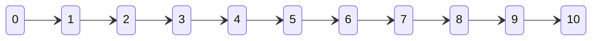
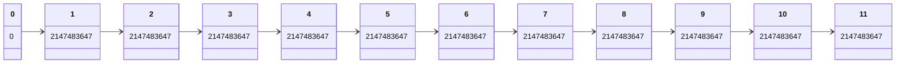

# Dynamic Programming

*Dynamic Programming*  alg design technique used to find optimal solutions to problems and to count the number osolutions.

## 6.1 Basic Concepts

### 6.1.1 When Greedy Fails

Suppose you were given a set of coins. and a target set of money *n*
. We are asked to construct the sum *n* using as few coins as possible. There are no restrictions on how many times we can use each coin value. Example conins = {1,2,5} and n = 12. the optimal solution is 5+5+2. This only requires 3 coins.

Will greedy work? Yes, but not optimal. example coins = {1,3,4} and n = 6. The greedy solution would do 4+1+1 = 6. The optimal solution is 3+3. 

### 6.1.2 Finding an optimal solution

1. to use dynamic programinging, we should formulate the problem recursively so that the solution to the porblem can be calculated from the solutions to small subproblems.
2. *memoization* - we store each function value in an array directly after calculating it.


Note: The code explanations in the book weren't bad, but the code examples didn't make a lot of sense to me. (They do make sense, but it seems to be psuedo c++ code.) I think they want you to right the code yourself. However, c++ is still pretty new to me. I found the code online. According to the website, the code isn't foptimized for larger numbers. 


The code min_coins_optimized.cpp 

"Since subproblems are computed, again and again, there is a condition of overlapping subproblems. The problem of recomputation can be solved using the property of memoization, i.e., create a dp[] array that stores the computed values at a particular stage. At each stage calculate all the possible combinations. After all the combinations, the last value in the dp[] array gives us the answer."

Book code seems wrong.

I have several versions of the code. Some work, some don't. Let's examine min_coin.cpp. (To run it just there is a shell script.)

The goal of the code is to figure out the mininmum amout of coins needed to make a specific value from a set of coins. We can use the coins as much as wanted. We are going to solve this via dynamic programing. The idea is still new to me, but I will try my best.

The main idea is we solve the problem by solving previous problems and using the information to solve the current problem. A little confusing in my description.

Example, we have three types of coins: 1, 2, and 5. We want to get to 11. To dynamically solve this, we should first solve how to make 0, 1, 2, 3, 4, ... and 10 coins. Let's construct a list that is 12 in length and 0 indexed.

|   0|1   |2   | 3  | 4  | 5  | 6  | 7  | 8  | 9  | 10  | 11  |
|---|---|---|---|---|---|---|---|---|---|---|---|
|  x | x  |  x | x  |  x |  x | x  |  x |x   |  x | x  | x  |


Now, let's first acknowledge we cannot make 0 coins. So the value for the first value is 0

|   0|1   |2   | 3  | 4  | 5  | 6  | 7  | 8  | 9  | 10  | 11  |
|---|---|---|---|---|---|---|---|---|---|---|---|
|  0 | x  |  x | x  |  x |  x | x  |  x |x   |  x | x  | x  |

For us to complete this, we need to initialize the array with a number higher than 11. In code, I use the value INT_MAX; the book uses infinity; and other examples us length of array + 1 (11+1). I will intialize the values at 12, so it's greater than 11.

|   0|1   |2   | 3  | 4  | 5  | 6  | 7  | 8  | 9  | 10  | 11  |
|---|---|---|---|---|---|---|---|---|---|---|---|
|  0 | 12  |  12 | 12  |  12 |  12 | 12  |  12 | 12  |  12 | 12  | 12 |

There will be 3 numbers we discuss, the coin value, the index, the difference between coin and index and the index value. Now let's solve the value on how many  coins we need to figure out for 1 coin. Reminder each index value in this context is also a sum of coins we want to try and find.

Let's grab the first coin 1 and subtract that from the index one. This equals 0, so we go to the 0 spot. 

|   0|1   |
|---|---|
|  0 | 12  |


It took at least one coin we add 1 to the difference value. (1-1) +1. Now we take that value (1) and compare to the value at the 1 index (12)

Is 1 < 12, if true replace the value with the lowest. We fill in the new value with 1 and the array updates. 

|   0|1   |2   | 3  | 4  | 5  | 6  | 7  | 8  | 9  | 10  | 11  |
|---|---|---|---|---|---|---|---|---|---|---|---|
|  0 | **1** |  12 | 12  |  12 |  12 | 12  |  12 | 12  |  12 | 12  | 12 |

Now, we go through all the coins to see if we can get something smaller than 1. Again, the second coin is 2 and we are at index value 1. 1-2 equals -1. This is out of range so we skip it. We only are looking at what is in the array. 1-5 is -4. Out of range.

Let's move onto 2. (2-1) Now the value is 1. Let's go to the 1 index and get the value from that which is 1. wE add 1 +1 to get two

|   0|1   | 2|
|---|---|--|
|  0 | **1** | 12|

1 + 1 = 2. 2 < 12 and we replace the value with 2. 

|   0|1   |2   | 
|---|---|---|
|  0 | 1 |  2 | 

Now use the 2 coin. 2-2  = 0 . The 0 index is 0. It's 0 + 1 = 1. This is less than 2. Update the values accordingly

|   0|1   |2   | 
|---|---|---|
|  0 | 1 |  1| 

2 - 5 is -3 and that is out of range. Now the table looks like this below

|   0|1   |2   | 3  | 4  | 5  | 6  | 7  | 8  | 9  | 10  | 11  |
|---|---|---|---|---|---|---|---|---|---|---|---|
|  0 | **1** |  **1** | 12  |  12 |  12 | 12  |  12 | 12  |  12 | 12  | 12 |

Let's do index 3 - the first coin. Again the value of that will be the index of the difference. Let's write a simple formula for that.


$$
value[index-coin_{value} + 1] 
$$

Continue on to 3. 
- We start with coin 1. $value[3-1]+1 $ 
- which works out to be $value[2]+1 = 2$.  
- is 2 less than 12. We replace the value with 2.

|   0|1   |2   | 3|
|---|---|---|--|
|  0 | 1 |  1| 2|

- Move on to the next coin 2: $value[3-2] +1 $ reminder value of value[3] is 2 and not 12. 
- so $value[1] + 1 = 2 Which is the same as 2, so no action
- $value[3-5]$ is out of range.
  
|   0|1   |2   | 3  | 4  | 5  | 6  | 7  | 8  | 9  | 10  | 11  |
|---|---|---|---|---|---|---|---|---|---|---|---|
|  0 | **1** |  **1** | **2**  |  12 |  12 | 12  |  12 | 12  |  12 | 12  | 12 |

Value 4.

- We start with coin 1. $value[4-1]+1$ 
- which works out to be $value[3]+1 = 3$.  
- is 3 less than 12. We replace the value with 3.
  
|   0|1   |2   | 3| 4| 
|---|---|---|---|---|
|  0 | 1 |  1| 2|3|

- Move on to the next coin 2: $value[4-2] +1 $ reminder value of value[4] is 3 and not 12. 
- so $value[2] + 1 = 2$ Which less than 3. Replace the value
|   0|1   |2   | 3| 4| 
|---|---|---|---|---|
|  0 | 1 |  1| 2|2|

- $value[4-5]$ is out of range.
  
|   0|1   |2   | 3  | 4  | 5  | 6  | 7  | 8  | 9  | 10  | 11  |
|---|---|---|---|---|---|---|---|---|---|---|---|
|  0 | **1** |  **1** | **2**  |  **2** |  12 | 12  |  12 | 12  |  12 | 12  | 12 |

Value 5

- We start with coin 1. $value[5-1]+1$ 
- which works out to be $value[4]+1 = 3$.  
- is 3 less than 12. We replace the value with 3.
  
|   0|1   |2   | 3| 4| 5|
|---|---|---|---|---|---|
|  0 | 1 |  1| 2|3| 3|

- Move on to the next coin 2: $value[5-2] +1 $ reminder value of value[5] is 3 and not 12. 
- so $value[3] + 1 = 3$ Which is the same: do nothing.
|   0|1   |2   | 3| 4| 5|
|---|---|---|---|---|---|
|  0 | 1 |  1| 2|3| 3|

- $value[5-5]$ is in range! Whooopie!
- Move on to the next coin 5: $value[5-5] +1 $ reminder value of value[5] is 3 and not 12. 
- so $value[0] + 1 = 1$ Which is less than 3. Replace the value
  
|   0|1   |2   | 3  | 4  | 5  | 6  | 7  | 8  | 9  | 10  | 11  |
|---|---|---|---|---|---|---|---|---|---|---|---|
|  0 | **1** |  **1** | **2**  |  **2** |  **1** | 12  |  12 | 12  |  12 | 12  | 12 |

The patter make sense so I will just fill out the rest of the table. Reminder, we must solve the previous value to solve the next value.

|   0|1   |2   | 3  | 4  | 5  | 6  | 7  | 8  | 9  | 10  | 11  |
|---|---|---|---|---|---|---|---|---|---|---|---|
|  0 | **1** |  **1** | **2**  |  **2** |  **1** | 2  |  3 | 3  |  3 | 2  | 3 |

The minimum amount of coins is 3.

One thing I find interesting about this algoritm is I don't know which coins  make of the min. It's approaching a problem differently. 


Code review!

min_coin.cpp


```c++
int main()
{
	int coins[] = {1,2,5 }; ;
	int m = sizeof(coins)/sizeof(coins[0]);
	int V = 11;
	cout << "Minimum coins required is "
		<< minCoins(coins, m, V) << "\n";
	return 0;
}
```
- initialize an array of coins, coins
- get the length of the coins, m
- and the value we are trying to achieve, V
- call the function that figures out the coins called minCoins


Within the function

First create a table or list that is the target value +1. Since the array starts at 0, we need to add a one to the length. If we didn't we would only go to 10 and not 11. If that doesn't make since, let's imagine initializing an array at 11 and not 12.




Notice how it goes to 10, but we need to figure out the value for 11.
```c++ 
int table[V+1];
	table[0]=0;
	for (int i = 1; i <= V; i++){
		table[i] = INT_MAX;
	}

```
We also intialize each value at INT_MAX except for the 0 index. We make that 0. Note, I'm showing the max value for 32 bit c++ code.



- Proceed to go through the array. We start at 1 since 0-index is 0 aka we know the answer. We are only doing the length of the array.
- Then we go through each coin.
- verify it's less than index value, so we don't get out of range errors.
- intialize a sub result (sub_res) from the value of table index. 
  - in our formula this would be equivalent to our value so $table[index - coin_{value}] = value[index - coin_{value}]$
- If our sub result +1 is less than the max we would fill it out.

```c++
 for (int i = 1; i <= V; i++) {
		// Go through all coins smaller than i
		for (int j = 0; j < m; j++){
			if (coins[j] <= i) {
				int sub_res = table[i - coins[j]];
				if (sub_res != INT_MAX
                    && sub_res + 1 < table[i]){
                    table[i] = sub_res + 1;
				}		
			}
		}
	}
```
Just verify the value isn't equal to the INT_MAX value otherwise return the value at the max place in the array.


```c++
if (table[V] == INT_MAX)
        return -1;
return table[V]
```
Notes: 
- I used this code: https://www.geeksforgeeks.org/find-minimum-number-of-coins-that-make-a-change/
  - I did write the code above in min_coin.cpp from my own memory. However, it's verbatim some code I found on geeks for geeks because I studied the code quiet a bit. 
- I didn't understand the code until I watched these two videos:
  - https://www.youtube.com/watch?v=Y0ZqKpToTic&ab_channel=TusharRoy-CodingMadeSimple
  - https://www.youtube.com/watch?v=jgiZlGzXMBw&t=423s&ab_channel=BackToBackSWE
  - Both videos are excellent. I didn't understand the algo. until I watched the videos. I knew what the code did, but didn't know why.
